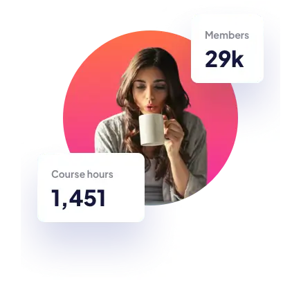

# 🚀 Frontend Mentor - Skilled e-learning landing page solution

This is a solution to the [Skilled e-learning landing page challenge on Frontend Mentor](https://www.frontendmentor.io/challenges/skilled-elearning-landing-page-S1ObDrZ8q). Frontend Mentor challenges help you improve your coding skills by building realistic projects.

---

## 🎬 Demo


---

## 🎯 The challenge

Users should be able to:

- View the optimal layout depending on their device's screen size
- See hover states for interactive elements

---

## 📸 Screenshots

| Mobile | Tablet | Desktop |
| --- | --- | --- |
|  |  |  |

---

## 🔗 Links

- 🌎 [Live site](https://vimpdev.github.io/fem-13-skilled-elearning-landing-page/)
- 🧑‍💻 [View solution on Frontend Mentor](https://www.frontendmentor.io/solutions/skilled-landing-page-mobile-first-layer-responsive-images-1ER6v43kaI)

---

## 🛠️ Built with

- Semantic HTML5
- Mobile-first workflow
- CSS custom properties
- CSS Grid
- Flexbox
- CSS `@layer` architecture
- Responsive images using `picture` + `srcset`
- **1x** / **2x** image strategy
- Accessible focus states

---

## 🧠 What I learned

This project allowed me to practice several modern CSS techniques and performance optimizations.

### 📌 Responsive images with `picture` and `srcset`

The hero image uses a responsive image strategy with different assets for mobile, tablet, and desktop.

It also includes **1x and 2x versions** for high-density displays.

```html
<picture class="hero-media">
  <source media="(min-width: 1200px)"
  srcset="./assets/images/image-hero-desktop.webp,
          ./assets/images/image-hero-desktop@2x.webp 2x">

  <source media="(min-width: 768px)"
  srcset="./assets/images/image-hero-tablet.webp,
          ./assets/images/image-hero-tablet@2x.webp 2x">

  
</picture>
```
The `fetchpriority="high"` attribute ensures the hero image is prioritized by the browser during page load.

### 📌 CSS architecture using @layer

The styles are organized using CSS cascade layers, which improves maintainability and avoids specificity issues.
```css
@layer reset, fonts, tokens, base, layout, components, responsive, states;
```
Each layer has a clear responsibility:
- reset → minimal CSS reset
- tokens → design variables
- base → base styles
- layout → layout utilities
- components → UI components
- responsive → breakpoints
- states → hover/focus states

### 📌 Preventing horizontal scroll

The hero image intentionally overflows its container to match the design.  
To prevent this from creating horizontal scroll on the page, the following property is used:
```css
.site-content {
  overflow-x: clip;
}
```
This safely clips overflowing content without creating scrollbars.

### 📌 Hover effect using layered backgrounds

The hover effect for the CTA buttons (hero and footer) is created using two background layers.  
A semi-transparent white layer fades in above the gradient background.
```css
.cta::before {
  content: '';
  position: absolute;
  inset: 0;
  background: linear-gradient(#ffffff80, #ffffff80);
  opacity: 0;
  transition: opacity .25s ease-in-out;
}
```
On hover or focus:
```css
.cta:is(:hover, :focus-visible)::before {
  opacity: 1;
}
```
This approach avoids altering the original gradient while creating the "lightened" hover state.

### 📌 Using `:is()` for cleaner state selectors

The `:is()` pseudo-class was used to simplify selectors and avoid repetition.
```css
.cta:is(:hover, :focus-visible)::before {
  opacity: 1;
}
```
This improves readability and keeps state management consistent across components.

---

## 🤖 AI Collaboration

AI tools were used during this project to:

- review CSS architecture decisions
- debug layout issues
- explore alternative implementations
- refine accessibility and performance improvements

The AI acted as a technical assistant, helping validate solutions and explore best practices while the final implementation decisions remained manual.

---

## 👩‍💻 Author

- Frontend Mentor &ndash; [@vimpdev](https://www.frontendmentor.io/profile/vimpdev)

---